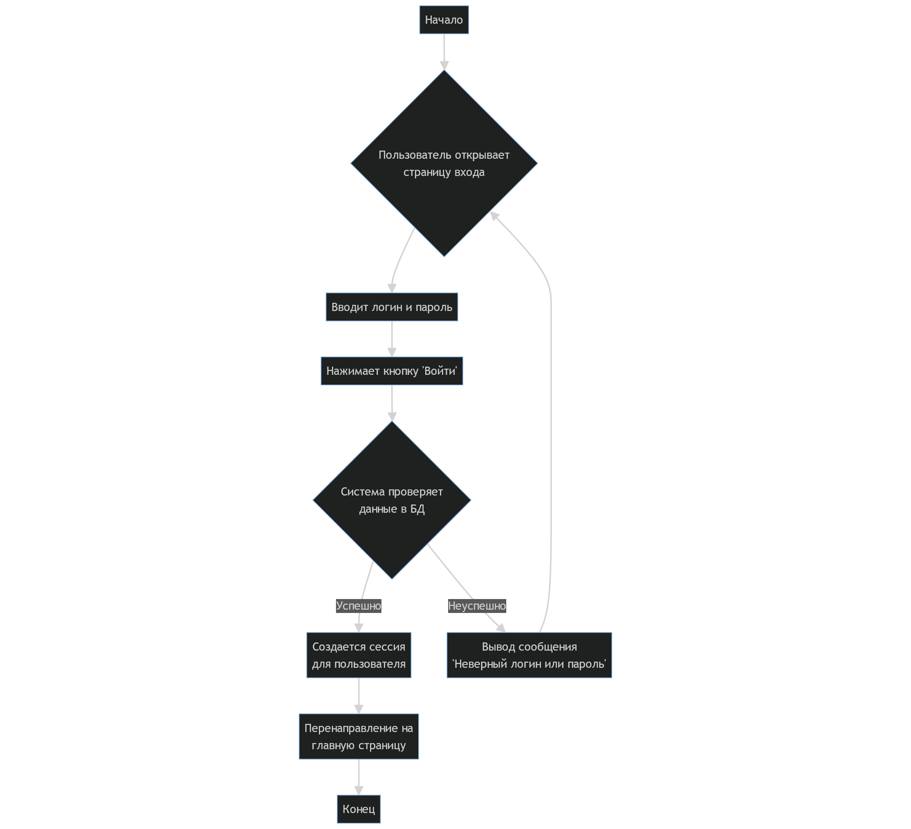
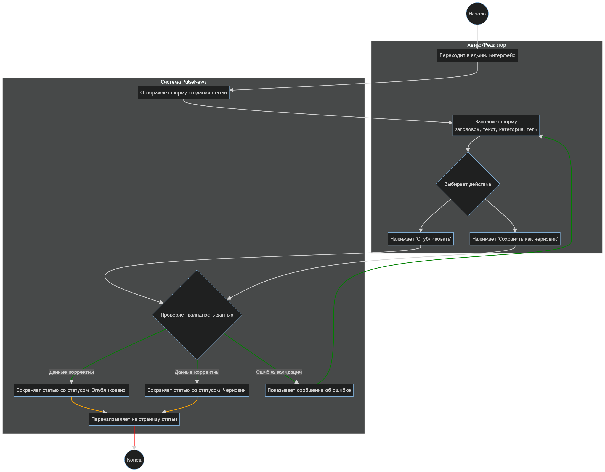

# Диаграммы активностей (Activity Diagrams)

Диаграммы активностей показывают динамику выполнения вариантов использования, демонстрируя последовательность действий и возможные решения.

---

## 1. Диаграмма активности для UC5: "Аутентификация пользователя"

Эта диаграмма иллюстрирует процесс входа пользователя в систему:

---

## 2. Диаграмма активности для UC9: "Публикация новой статьи" (для Автора/Редактора)

Диаграмма демонстрирует шаги, которые выполняет Автор или Редактор при создании и публикации статьи:

---
