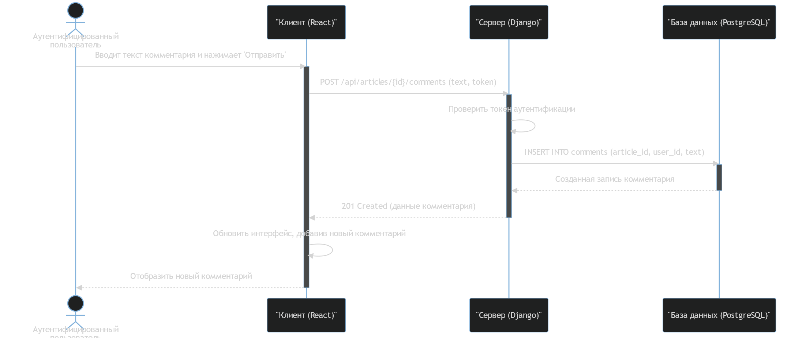
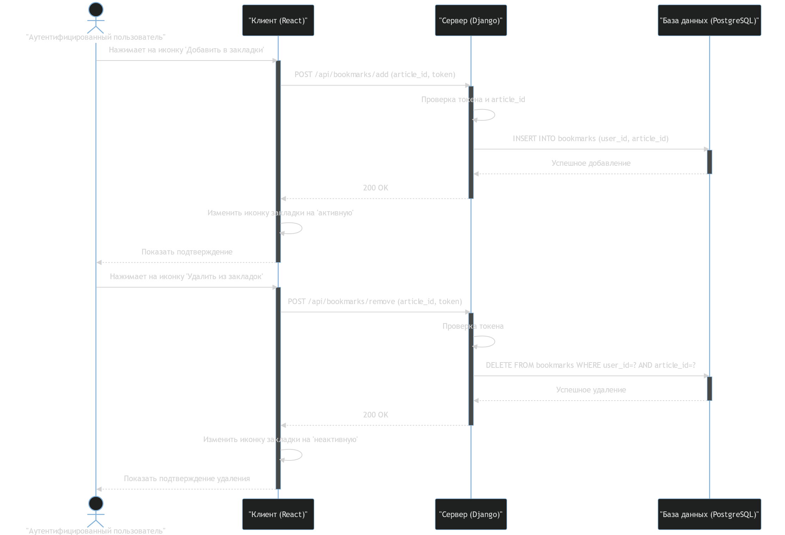

# Диаграммы последовательности (Sequence Diagrams)

Диаграммы последовательности демонстрируют взаимодействие объектов во времени и показывают порядок обмена сообщениями между ними.

---

## 1. Диаграмма последовательности для UC6: "Комментирование статьи"

Эта диаграмма иллюстрирует процесс, в котором аутентифицированный пользователь оставляет комментарий под статьей:

---

## 2. Диаграмма последовательности для UC8: "Добавление статьи в закладки"

Диаграмма показывает шаги, выполняемые аутентифицированным пользователем при добавлении статьи в закладки:

---
