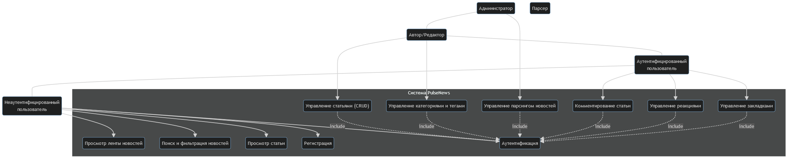

# Модель вариантов использования (Use Case)

Модель вариантов использования описывает функции системы с точки зрения пользователей (акторов) и показывает, как они взаимодействуют с системой.

---

## 1. Акторы (Actors)

- **Неаутентифицированный пользователь**: Посетитель сайта, который не вошел в систему.  
- **Аутентифицированный пользователь**: Зарегистрированный пользователь, вошедший в систему. Является специализацией Неаутентифицированного пользователя.  
- **Автор/Редактор**: Пользователь, отвечающий за контент. Является специализацией Аутентифицированного пользователя.  
- **Администратор**: Пользователь с полными правами. Является специализацией Автора/Редактора.  
- **Парсер (Внешняя система)**: Автоматизированный скрипт для сбора новостей.

---

## 2. Диаграмма вариантов использования (Use Case Diagram)

---

## 3. Описание вариантов использования (Flow of Events)

### UC2: Поиск и фильтрация новостей
**Акторы:** Неаутентифицированный пользователь, Аутентифицированный пользователь  
**Описание:** Позволяет пользователю находить статьи по ключевым словам и применять фильтры по категориям, тегам и дате.  
**Предусловие:** Пользователь находится на сайте.

**Основной поток событий (Basic Flow):**  
1. Пользователь вводит поисковый запрос в поле поиска на главной странице или в специальном разделе поиска.  
2. Пользователь нажимает кнопку "Найти".  
3. Система выполняет поиск по заголовкам и текстам статей в базе данных.  
4. Система отображает страницу с результатами поиска – список статей, отсортированных по релевантности или дате.  
5. Пользователь видит панель фильтров (категории, теги, диапазон дат).  
6. Пользователь выбирает один или несколько фильтров (например, категорию "Технологии" и тег "AI").  
7. Пользователь нажимает кнопку "Применить фильтры".  
8. Система обновляет список найденных статей в соответствии с фильтрами.  
9. Пользователь выбирает статью из списка для просмотра.

**Альтернативные потоки (Alternative Flows):**  
- **A1: Поиск не дал результатов**  
  - На шаге 4 система не находит статьи.  
  - Система отображает сообщение: "По вашему запросу ничего не найдено. Попробуйте изменить формулировку".  
- **A2: Некорректная дата в фильтре**  
  - На шаге 6 пользователь вводит некорректный диапазон дат.  
  - При нажатии "Применить фильтры" система подсвечивает поля с датами и выводит сообщение: "Некорректный диапазон дат".

---

### UC9: Управление статьями (CRUD)
**Акторы:** Автор/Редактор, Администратор  
**Описание:** Предоставляет возможность создавать, редактировать, публиковать и удалять новости.  
**Предусловие:** Пользователь аутентифицирован и имеет права Автора/Редактора.

**Основной поток событий (Создание новой статьи):**  
1. Автор/Редактор переходит в административный интерфейс и выбирает опцию "Создать статью".  
2. Система отображает форму создания статьи с полями: "Заголовок", "Текст статьи", "Категория", "Теги".  
3. Пользователь заполняет заголовок и текст статьи с помощью текстового редактора.  
4. Пользователь выбирает существующую категорию или создает новую.  
5. Пользователь добавляет один или несколько тегов.  
6. Пользователь нажимает кнопку "Опубликовать".  
7. Система проверяет, что все обязательные поля заполнены.  
8. Система сохраняет статью в базе данных со статусом "Опубликовано".  
9. Система перенаправляет пользователя на страницу созданной статьи и выводит сообщение об успешном создании.

**Альтернативные потоки (Alternative Flows):**  
- **A1: Сохранение как черновик**  
  - На шаге 6 пользователь нажимает "Сохранить как черновик".  
  - Система сохраняет статью со статусом "Черновик". Статья не отображается в ленте новостей.  
- **A2: Ошибка валидации**  
  - На шаге 7 система обнаруживает незаполненное обязательное поле.  
  - Система подсвечивает поле и выводит сообщение: "Это поле обязательно для заполнения".  
- **A3: Редактирование статьи**  
  - Пользователь открывает существующую статью в режиме редактирования.  
  - Поток повторяет шаги 2–9 основного потока, обновляя существующую запись.  
- **A4: Удаление статьи**  
  - Пользователь нажимает "Удалить" на странице редактирования или в списке статей.  
  - Система запрашивает подтверждение: "Вы уверены, что хотите удалить эту статью?".  
  - Пользователь подтверждает удаление.  
  - Система удаляет статью из базы данных.
