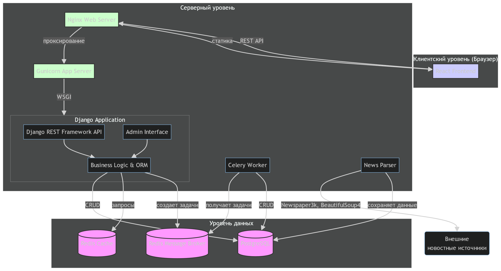

# Диаграмма компонентов (Component Diagram)

Диаграмма компонентов демонстрирует архитектуру программного обеспечения и зависимости между основными компонентами системы **PulseNews**.  
Она показывает, как различные модули взаимодействуют друг с другом и с внешними системами.

