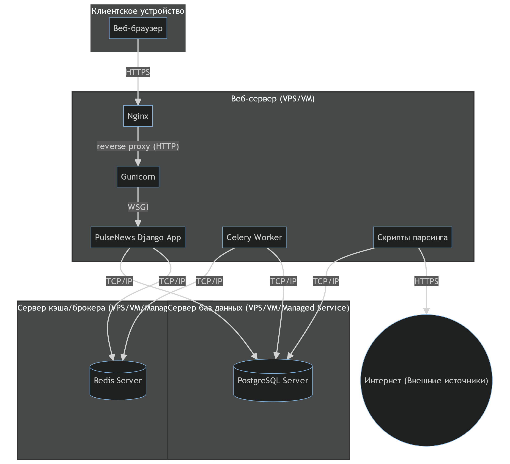

# Диаграмма развертывания (Deployment Diagram)

Диаграмма развертывания показывает, как программные компоненты системы **PulseNews** распределены по физическим или виртуальным узлам.  
Она иллюстрирует расположение серверов, клиентских устройств и взаимодействие между ними.

