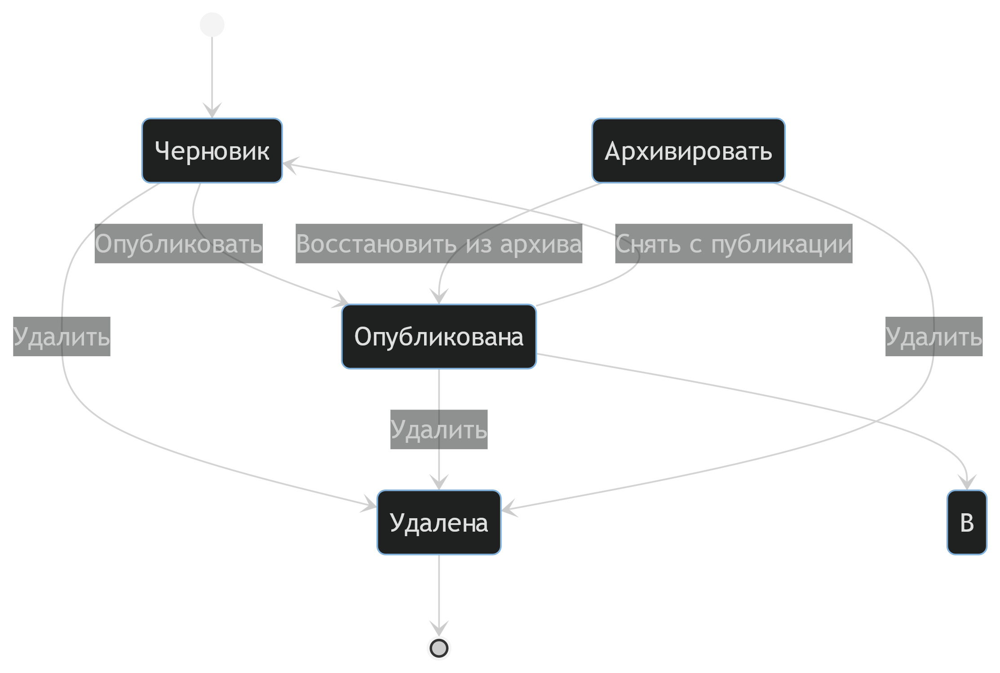

# Диаграмма состояний (State Machine Diagram)

Диаграмма состояний показывает жизненный цикл объекта **Article (Новостная статья)** в системе **PulseNews**.

## Диаграмма состояний для статьи

## Описание состояний и переходов

- **Черновик**: Начальное состояние после создания статьи автором. Статья не видна обычным пользователям.  
- **Опубликована**: Статья видна всем пользователям на портале. Переход в это состояние делает статью общедоступной.  
- **В архиве**: Статья больше не актуальна, но сохранена в системе. Не отображается в основной ленте.  
- **Удалена**: Конечное состояние. Статья полностью удаляется из системы.
